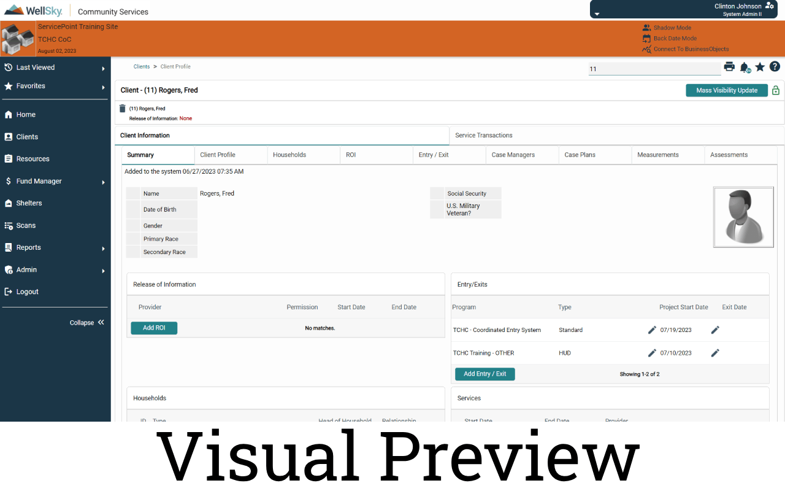

# HMIS Visual Enhancement plugin

This is the code used in the HMIS Visual Enhancement plugin which can be found in the Chrome Web Store at https://chrome.google.com/webstore/detail/hmis-visual-enhancement/jljoagmpankhfnoaffddgmjioebmfafk The plugin is also now awaiting approval in the Microsoft Edge Add-On Store.

Currently the plugin only loads a CSS file when visiting sp5.servicept.com/\* Feel free to create pull requests for other CSS changes or features in this repo. I would like to add some features such as setting a custom URL in the plugin settings to launch your community's HMIS when the plugin is clicked.

You may also clone this repo or download the contents here, enable Chrome Developer mode, and load as an "unpacked" extension.

https://developer.chrome.com/docs/extensions/mv3/getstarted/development-basics/#load-unpacked

